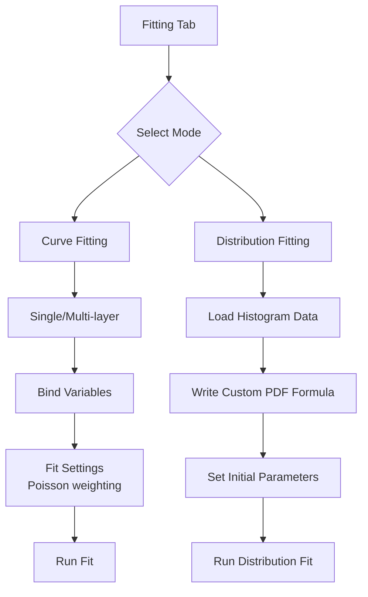

# Curve Fitting & Distribution Fitting Enhancements Plan

## 1. Overview

The recent backend overhaul introduced multi‑layer ODR fitting, Poisson weighting, and point‑correlation support. To fully leverage these capabilities, the frontend must be extended with appropriate UI controls. Additionally, a new “distribution fitting” feature for histograms will broaden the application scope of AnaFis.

This document outlines the detailed plan for implementing these enhancements.

## 2. Backend Mathematical Accuracy Assessment

The ODR engine (`engine.rs`) uses a Levenberg‑Marquardt algorithm with the following safeguards:

- **Damping adjustment** scaled by diagonal entries of the normal matrix.
- **SVD pseudo‑inverse** with a tolerance of `1e‑14` for covariance estimation.
- **Finite‑value checks** at every evaluation step.
- **Minimum variance clamping** (`MIN_VARIANCE = 1e‑24`) to avoid division by zero.
- **Robust convergence criteria** based on gradient norm and parameter‑step size.

**Conclusion**: The implementation follows established numerical best practices and is suitable for production use. No immediate changes are required.

## 3. Frontend Enhancements for New Backend Features

### 3.1 Multi‑layer Fitting UI

**Current state**: The frontend builds a single‑layer request (`layers[0]`). The backend supports an arbitrary number of layers.

**Proposed changes**:

1. **ModelSection component** – Replace the single‑formula input with a dynamic list of layers.
   - Each layer has:
     - Formula input (string)
     - Dependent variable name (string, auto‑generated or user‑defined)
     - Independent variable names (list, auto‑generated from formula parsing)
   - Buttons to add/remove layers.
   - Layer reordering (drag‑and‑drop optional).

2. **BindingsSection** – Must map each layer’s dependent variable to a data column (currently only one dependent variable). Extend to support multiple dependent bindings.

3. **Request builder (`requestBuilder.ts`)** – Already supports `layers[]`; need to construct one layer per UI layer, collect all dependent variables into `dependentVariables[]`.

**Design considerations**:
- Keep backward compatibility: single‑layer mode as default.
- Advanced multi‑layer UI can be hidden behind an “expert mode” toggle initially.

### 3.2 Poisson Weighting Toggle

**Current state**: The field `usePoissonWeighting` is omitted in the request.

**Proposed changes**:

1. Add a checkbox in the **FitSettingsSection** labeled “Use Poisson weighting (1/√N)”.
2. Store the boolean in `AdvancedSettings` (new field `usePoissonWeighting`).
3. Pass the value to `requestBuilder` and include it in the `OdrFitRequest`.

**Implementation steps**:
- Extend `fittingTypes.ts`: `AdvancedSettings.usePoissonWeighting?: boolean`.
- Update `FitSettingsSection` UI.
- Update `requestBuilder` to include the field.

### 3.3 Point Correlations UI

**Current state**: The frontend can optionally send `pointCorrelations` (3D array), but there is no UI to define them.

**Proposed changes**:

1. **New sidebar panel** “Uncertainty Correlations” (or extend existing Uncertainty sidebar).
   - Matrix editor for each data point (if point count small) or allow uploading a correlation matrix file.
   - For large datasets, provide a “constant correlation coefficient” slider (single value applied to all points).

2. **Data structure**: Keep `correlationMatrices` in `FitState` as `number[][][] | null`.

3. **Integration** with existing uncertainty UI (maybe combine with uncertainty columns).

**Priority**: Low – can be deferred to a later phase.

### 3.4 Tolerance and Damping Settings

**Current state**: The frontend `AdvancedSettings` includes `tolerance` and `initialDamping` fields, but they are not passed to the backend ODR solver (which uses hard‑coded defaults). Users cannot adjust convergence tolerance or damping factor.

**Proposed changes**:

1. **Extend OdrFitRequest** – Add optional `tolerance` and `initialDamping` fields (both `Option<f64>` in Rust, `number | undefined` in TypeScript).
2. **Backend integration** – In `commands.rs`, read these fields and pass them to `solve_odr`. Fall back to `DEFAULT_TOLERANCE` and `DEFAULT_DAMPING` when not provided.
3. **UI limits and steps** – In `FitSettingsSection`, add validation and stepping:
   - **Tolerance**: range 1e‑12 to 1, step 1e‑9 (or allow any value via scientific‑notation input).
   - **Initial damping**: range 1e‑6 to 1, step 0.01 (as requested).
   - **Max iterations**: already clamped (5–5000) in backend; frontend should reflect same limits (min 5, max 5000).
4. **Input improvements** – Optionally replace plain number inputs with logarithmic sliders for tolerance/damping (future enhancement).

**Priority**: Medium – enables finer control over ODR convergence.

### 3.5 Conditional Poisson Weighting

**Current state**: The Poisson weighting checkbox appears for all fits, regardless of whether the data represent counts (distribution fitting).

**Proposed changes**:

1. **Mode detection** – Introduce a “fitting mode” toggle (Curve Fitting / Distribution Fitting). In Distribution Fitting mode, Poisson weighting is automatically enabled (and the checkbox hidden).
2. **Default behavior** – If the data consist of a single independent variable and the user selects “Histogram” visualization, treat as distribution fitting and enable Poisson weighting by default.
3. **UI adjustments** – Hide the Poisson weighting checkbox when distribution fitting is active; show a note explaining that 1/√N weighting is applied.

**Priority**: Medium – improves user experience for distribution fitting.

### 3.6 Multi‑layer UI with Variable Definitions

**Current state**: The UI currently supports only a single formula (layer). The backend supports multiple layers, but there is no intuitive way for users to define a system of equations where intermediate variables are defined by their own formulas.

**Proposed changes**:

1. **Multi‑layer toggle** – Add a “Multi‑layer” switch in the ModelSection. When enabled, reveal a dynamic list of variable definitions.
2. **Primary formula** – The user can write the main dependent variable equation, optionally with an equals sign (e.g., `y = m*x + b`). The left‑hand side is interpreted as the dependent variable name; the right‑hand side is the formula sent to the backend.
3. **Variable definition blocks** – For each variable that appears in any formula (except those already bound to data columns), the user can provide a defining formula. Each block consists of:
   - Variable name (auto‑populated from parsed formulas, editable).
   - Formula input (supports the same syntax as the primary formula).
   - Buttons to add/remove definitions.
4. **Parameter discovery** – The UI collects all unknown symbols from all formulas and presents them in a unified parameter list (initial guesses, fixed/free toggles).
5. **Visualization options** – The system can display two kinds of plots:
   - **Per‑layer graphs** (default): each equation is plotted separately (e.g., `y vs x1, x2` and `x1 vs x2`), showing the relationships exactly as defined.
   - **Flattened graph** (optional): if the SymbAnaFis library provides symbolic substitution, the UI can substitute intermediate variables to show the top‑level dependent variable directly as a function of the independent variables (e.g., `y = a*b*x2 + x2 + c`). This substitution is purely for visualization and does not affect the fit. The substitution will be performed by the SymbAnaFis library via a Tauri command (or WASM module) called from the frontend. A toggle “Show flattened equation” can be added.

**Example workflow**:
- User writes primary formula `y = a*x1 + x2 + c`.
- Variables `x1` and `x2` are not bound to data columns; the UI suggests adding definitions.
- User adds definition `x1 = b * x2`. Now `x2` is the only remaining undefined variable; it must be bound to a data column.
- Parameters `a`, `b`, `c` appear in the parameter list.
- The user can toggle “Flatten” to see the derived equation `y = a*b*x2 + x2 + c`.

**Priority**: High – enables complex multi‑layer modeling with intuitive UI.

### 3.7 Formula Parsing with Equals Sign

**Current state**: Formulas must be written as expressions; the dependent variable name is specified separately.

**Proposed changes**:
- Allow the user to write `y = m*x + b` (or any left‑hand side identifier followed by `=`) in the formula input.
- The UI strips the left‑hand side and uses it as the dependent variable name (overriding the separate dependent variable field).
- The backend receives only the right‑hand side expression (as today).
- If no equals sign is present, fall back to the existing behavior.

**Implementation**: Simple string splitting at the first `=`; trim whitespace.

**Priority**: Low – convenience improvement.

## 4. Distribution Fitting for Histograms (User‑Defined Functions)

### 4.1 Overview

Allow users to fit a **user‑defined probability density function (PDF)** to binned histogram data. Unlike traditional distribution fitting that offers pre‑defined distributions, this approach treats the histogram as a set of (bin center, count) points and uses the existing ODR engine with Poisson weighting. The user supplies a custom formula (e.g., `a*exp(-(x‑mu)^2/(2*s^2))`) and the fit estimates the formula’s parameters.

**Key characteristics** (from user feedback):
- Graphs are always histograms (binned visualization).
- Only a single independent variable (the quantity being histogrammed).
- No default distribution functions – the user writes the PDF formula directly.
- Poisson weighting is automatically applied (since counts have √N uncertainty).

### 4.2 Backend Requirements

No new backend commands are strictly necessary; the existing ODR engine can already fit any custom formula to (x, y) data with Poisson weighting. However, to improve the user experience, we can add a convenience command that:
- Accepts raw data (unbinned) and performs automatic binning (selectable bin width/range).
- Returns the binned data (centers, counts) for preview.
- The actual fit is performed via the existing `fit_custom_odr` command.

**Implementation approach**:
- Extend the existing `fit_custom_odr` request to optionally carry a “histogram mode” flag that automatically enables Poisson weighting and validates single‑variable input.
- Alternatively, keep the frontend responsible for binning and pass the binned data as ordinary points.

### 4.3 Frontend UI

**Integration**: Add a “Histogram Mode” toggle within the FittingTab. When enabled:

1. **Data source** – a single column selector for the raw variable. The UI provides bin‑size controls (number of bins, bin width, range) and generates the histogram preview.
2. **Formula input** – the same formula editor as curve fitting, but with guidance that the formula should represent a PDF (positive, integrable). The dependent variable is the count (or probability density).
3. **Automatic Poisson weighting** – the Poisson weighting checkbox is hidden and forced to `true`. A note explains that 1/√N weighting is used.
4. **Visualization** – the main plot shows the histogram bars with the fitted curve overlaid. The X‑axis is the bin center, Y‑axis is count (or normalized frequency).

**UI components**:
- Bin settings panel (similar to existing “Quick Plot” sidebar).
- Histogram preview (optional).
- Formula editor (reuse ModelSection).
- Fit button (same as curve fitting).

### 4.4 Implementation Steps

1. **Frontend histogram generation** – implement binning logic in a new hook `useHistogramBinning`.
2. **Mode toggle** – add a “Histogram / Curve” switch in the FittingTab header.
3. **Conditional UI** – hide multi‑layer controls, show bin settings, hide Poisson weighting checkbox.
4. **Backend adjustments** – optional “histogram mode” flag in OdrFitRequest (low priority).
5. **Testing** – verify that fitting a Gaussian to a normally‑distributed sample yields correct parameters.

**Priority**: High – aligns with user’s immediate need.

## 5. Phased Implementation Plan

### Phase 1 – Poisson Weighting & Basic UI (Completed)
- **Status**: Implemented.
- **Tasks completed**:
  1. Added `usePoissonWeighting` field to `AdvancedSettings`.
  2. Added toggle checkbox in `FitSettingsSection`.
  3. Updated `requestBuilder` to include the flag.
  4. Verified backend integration (existing `use_poisson_weighting` field).
- **Next**: No further action required.

### Phase 2 – Tolerance & Damping Integration (Completed)
- **Status**: Implemented.
- **Tasks completed**:
  1. Extended `OdrFitRequest` types (frontend and backend) with optional `tolerance` and `initialDamping` fields.
  2. Wired these fields through `requestBuilder` and passed to backend ODR solver.
  3. Added UI limits and step sizes in `FitSettingsSection`:
     - Tolerance: range 1e‑12 to 1, step 1e‑9 (allow scientific notation).
     - Initial damping: range 1e‑6 to 1, step 0.01.
     - Max iterations: enforce backend limits (5–5000).
  4. Updated backend `commands.rs` to use provided tolerance/damping (falls back to defaults).
- **Next**: No further action required.

### Phase 3 – Histogram Mode (User‑Defined Distribution Fitting)
- **Tasks**:
  1. Frontend histogram generation: implement `useHistogramBinning` hook with bin controls.
  2. Add “Histogram / Curve” mode toggle in `FittingTab` header.
  3. Conditional UI: show bin settings, hide multi‑layer controls, hide Poisson weighting checkbox (auto‑enabled).
  4. Reuse existing formula editor for custom PDF.
  5. Visualization: overlay fitted curve on histogram bars.
  6. Optional backend flag for histogram mode (low priority).
- **Estimate**: 2–3 days.

### Phase 4 – Multi‑layer UI (Deferred)
- **Tasks**:
  1. Update `ModelSection` to support dynamic layers (add/remove).
  2. Extend bindings logic for multiple dependent variables.
  3. Adjust request builder for multiple layers.
- **Estimate**: 2–3 days.

### Phase 5 – Advanced Features
- **Tasks**:
  1. Point correlations UI.
  2. 3D+ visualization improvements (review existing results display).
  3. Goodness‑of‑fit tests (χ², KS) for histogram fits.
  4. Additional distribution templates (optional).
- **Estimate**: 3–5 days.

## 6. Risks & Mitigations

| Risk | Mitigation |
|------|------------|
| Increased UI complexity may confuse users | Provide “simple/advanced” toggle; keep default single‑layer. |
| Performance of multi‑layer ODR with many points | Backend already uses batched evaluation; monitor performance. |
| Distribution fitting MLE may not converge for poor data | Implement robust fallbacks and clear error messages. |
| Timeline overruns due to scope creep | Strictly follow phased approach; deliver MVP first. |

## 7. Diagrams

### UI Flow (Simplified)

## 8. Next Steps

1. **Review this plan** with stakeholders.
2. **Prioritize phases** based on user needs.
3. **Switch to Code mode** for implementation of Phase 1.

---
*Document generated on 2026‑02‑21*