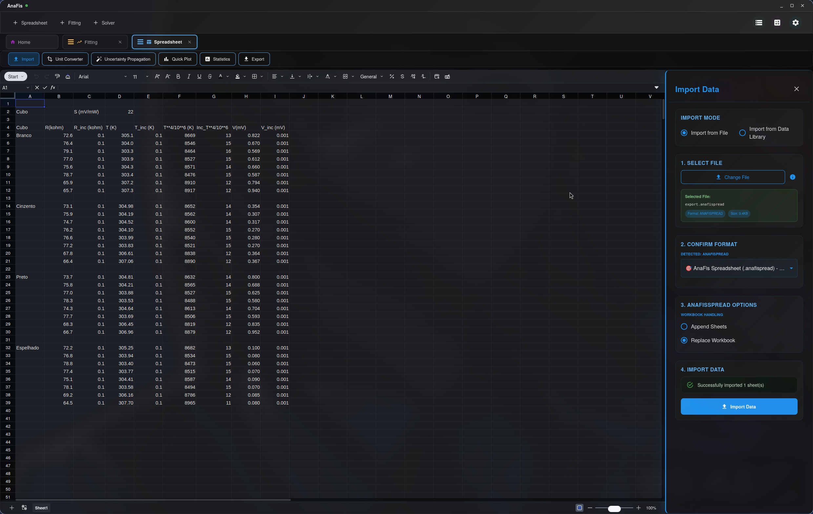
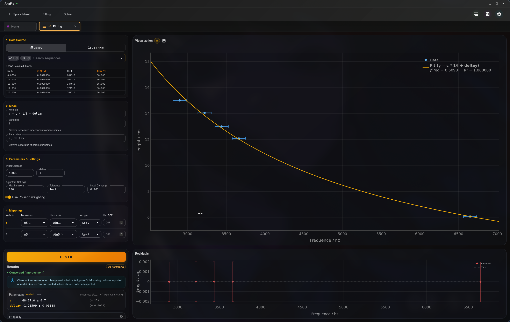
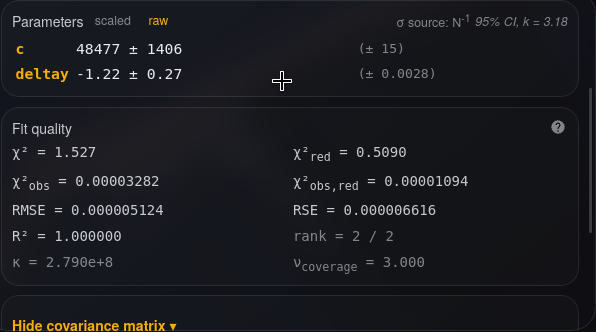
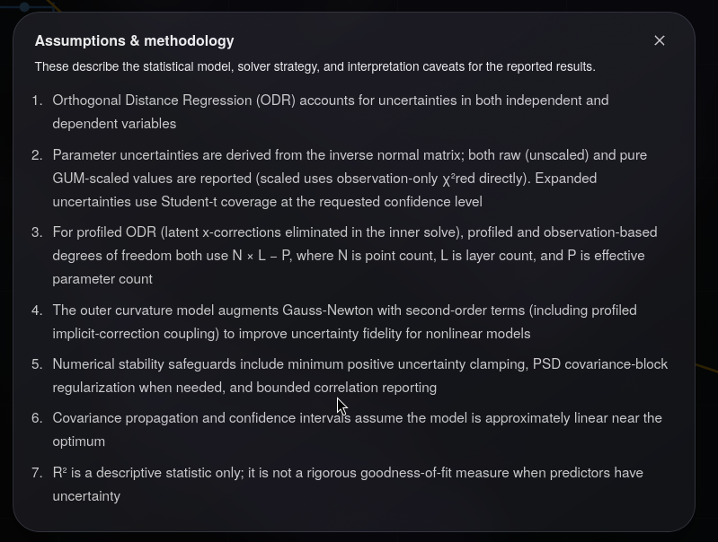
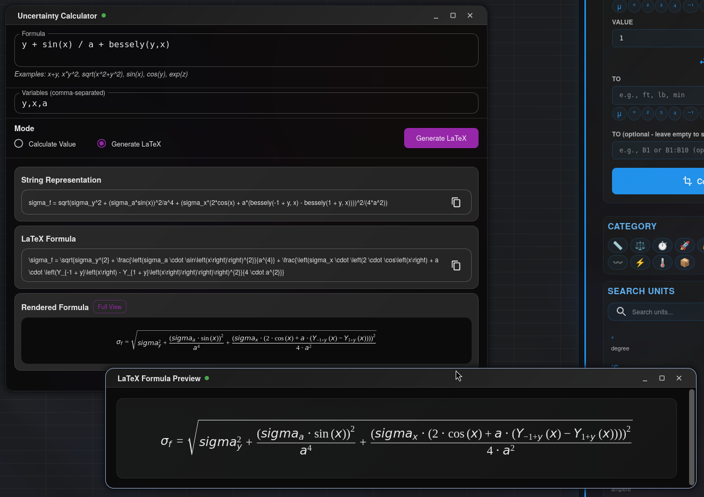
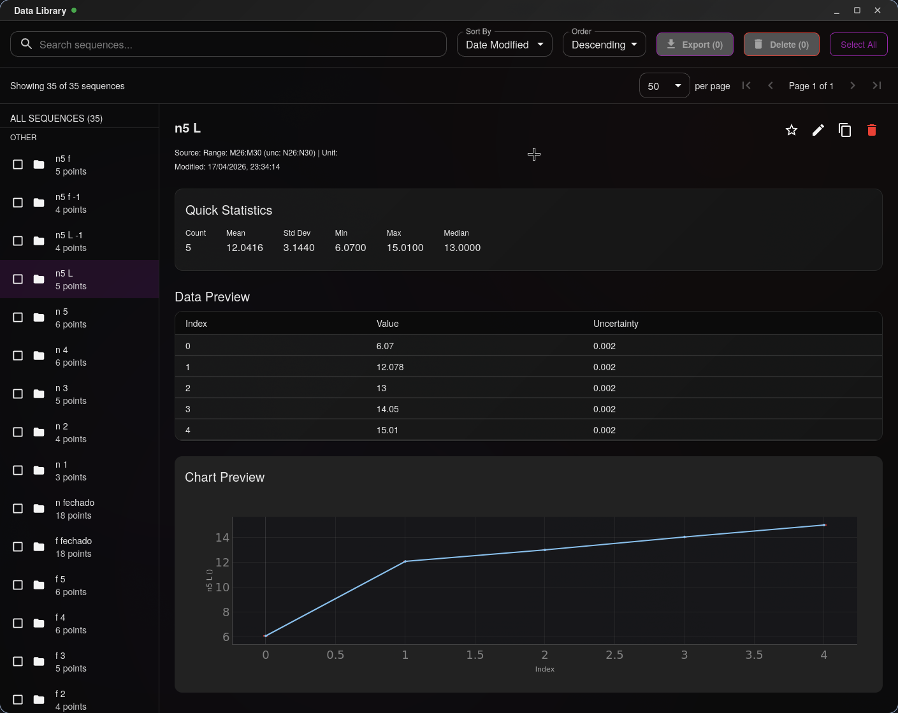
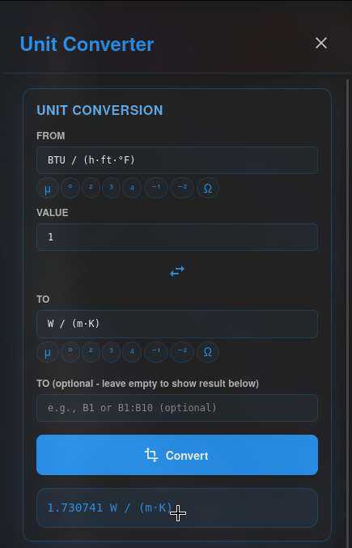

# AnaFis

**AnaFis** is a cross-platform desktop application for experimental and scientific data analysis.
It provides a unified notebook-style workspace combining a spreadsheet, a curve-fitting engine,
and an equation solver — all powered by a Rust numerical backend and the `symb_anafis` symbolic engine.

> **Development Note (`symb_anafis`)**: Currently, the symbolic algebra system (CAS) strips floating-point epsilon noise (e.g., snapping values below `1e-14` to `0`, and rounding values like `3.00000000000001` to `3`) when parsing or computing expressions. (This does *not* affect the compiled numerical evaluation used during the actual fitting process). A fully typed, arbitrary-precision number backend—featuring automatic Int/Rational/Float conversions to preserve exactness—is actively being built. This will fundamentally resolve the issue by replacing the hacky workarounds that were originally implemented to negate float precision loss back when float64 was the only numeric type available in the AST.

## Implemented Features

### Spreadsheet
- Univer.js spreadsheet with formula support
- Sidebar-driven data flow: extract columns from sheet → compute in Rust → write results back
- Import and Export sidebars integrated directly into the sheet toolbar



### Curve & Distribution Fitting
- **Orthogonal Distance Regression (ODR)** with Levenberg-Marquardt optimisation
- Model functions typed as free-form expressions and parsed symbolically by `symb_anafis`
- Error bars on both X and Y axes with optional Poisson weighting (for count/histogram data)
- Configurable initial parameter guesses, max iterations, convergence tolerance, and initial damping factor
- Data sources: Data Library sequence selector or direct CSV/TSV/TXT/DAT file import with configurable delimiter, header, and decimal settings
- 2D, 3D, and N-D axis modes with linear/log scale per axis
- **Results panel**:
  - Parameter values with uncertainties — switchable between scaled (χ²_red · N⁻¹) and raw (N⁻¹) basis
  - Expanded uncertainties with coverage factor *k* and Welch-Satterthwaite effective degrees of freedom
  - Fit quality metrics: χ², χ²_red, χ²_obs, χ²_obs,red, RMSE, RSE, R²
  - Effective rank and condition number κ for numerical health
  - Full covariance and correlation matrix viewer (collapsible, scrollable)
  - Convergence status: gradient / step-size / improvement / stagnated / singular / damping-saturated / max-iterations
  - Assumptions & methodology dialog



<p align="center">
  
  
</p>

### Uncertainty Propagation
- Sidebar calculator: propagates uncertainties through arbitrary user-typed formulas
- Exact symbolic differentiation via `symb_anafis` (no finite differences fallback)
- Dedicated uncertainty calculator window for standalone use (not tied to the spreadsheet)




### Data Management
- Persistent SQLite Data Library with full-text search (FTS5), statistics, and chart preview
- **Export**: CSV only (from sequence view)



### Spreadsheet Sidebars
- **Import** — load data into the active sheet (CSV, TSV, TXT, JSON, Parquet, `.anafispread`) or from the Data Library
- **Export** — export sheet data in 10 formats (CSV, TSV, TXT, JSON, XLSX, Parquet, HTML, Markdown, LaTeX, AnaFisSpread)
- **Quick Plot** — 2D scatter/line plots with optional error bars, powered by Plotly
- **Unit Conversion** — a rigorous, Rust-backed dimensional analysis engine. Supports compound algebraic expressions (e.g., `(kg·m⁻²)/(s⁴·A⁻¹)`), dynamic SI prefix resolution, Unicode exponents, and strictly enforces dimensional compatibility to prevent unphysical conversions.



### Utility Windows
- Data Library browser (search, filter, preview, tag)
- Settings
- Standalone Uncertainty Calculator

## Planned / In Progress

- **Statistical Analysis sidebar** — Bayesian descriptive stats, distance correlation, permutation tests
- **Data Smoothing sidebar** — Savitzky-Golay, LOWESS, Gaussian, FFT filters
- **Outlier Detection sidebar** — Weighted Isolation Forest, conformal bounding, remedial actions
- **Equation Solver tab** — currently a placeholder
- **Uncertainty Univer Plugin** — automatic in-cell propagation with `±` notation

## Tech Stack

| Layer | Technology |
|---|---|
| Desktop shell | Tauri 2 |
| Frontend | React 19 + TypeScript, Vite, Zustand |
| Spreadsheet | Univer.js |
| Visualisation | Plotly |
| Backend | Rust — Nalgebra, Rusqlite, Arrow/Parquet, Rayon |
| CAS / Differentiation | `symb_anafis` (custom symbolic engine) |
| Packaging | Flatpak (Linux), MSI/EXE (Windows) |

## Prerequisites

- Rust toolchain (`rustup`)
- Bun (recommended) or Node.js
- Platform build dependencies for Tauri 2 (see [Tauri docs](https://tauri.app/start/prerequisites/))

## Development

```bash
cd AnaFis
bun install
bun run tauri dev
```

## Production Build

```bash
cd AnaFis
bun run tauri build
# Output: AnaFis/src-tauri/target/release/bundle/
```

## Project Layout

```
AnaFis/          — Frontend (React/TS) + Tauri glue
  src/           — React source
  src-tauri/     — Rust backend
Installer/
  Linux/Flatpak/ — Flatpak manifest and build instructions
  Windows/       — MSI/signing strategy
Plans/           — Development roadmap (plans.md)
Docs/            — Operational documentation
```

## Architecture

- **Rust** handles all computation: fitting, uncertainty propagation, I/O, and future statistics.
- **TypeScript/React** handles UI state and user interactions only — zero math in the frontend.
- **IPC** via Tauri commands is explicit and typed end-to-end.

## License

Apache-2.0. See `LICENSE`.
